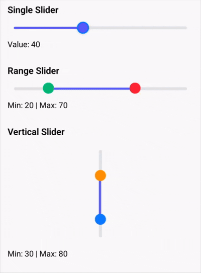

# react-native-multi-range-slider

A highly customizable, smooth, and performant single & multi-range slider component for React Native.

Supports dual thumbs, single thumb mode, vertical orientation, custom markers, ScrollView integration, and full TypeScript support.

---

## ✨ Demo

<p align="center">
  
</p>

## ✨ Features

- 🎯 Single slider & dual thumb (range) slider
- 📏 Horizontal and Vertical modes
- 👆 Press anywhere on track to move nearest thumb
- 🎨 Fully customizable track, selected range & markers
- 🧩 Universal custom marker
- 🔀 Separate custom Left & Right markers
- 📜 Optional ScrollView integration via `scrollRef`
- ⚡ Highly smooth and responsive interactions
- 🧠 TypeScript support
- 📱 Works on both iOS and Android

---

## 📦 Installation

```bash
npm install react-native-multi-range-slider
```

or

```bash
yarn add react-native-multi-range-slider
```

---

# 🚀 Basic Usage (Multi Slider)

```tsx
import React, { useState } from "react";
import { View, Text } from "react-native";
import MultiRangeSlider from "react-native-multi-range-slider";

const Example = () => {
  const [range, setRange] = useState<[number, number]>([20, 80]);

  return (
    <View style={{ padding: 20 }}>
      <Text>
        Selected: {range[0]} - {range[1]}
      </Text>

      <MultiRangeSlider
        min={0}
        max={100}
        values={range}
        onValuesChange={setRange}
      />
    </View>
  );
};

export default Example;
```

---

# 🎯 Single Slider Mode

Pass a single value in `values`:

```tsx
<MultiRangeSlider
  min={0}
  max={100}
  values={[50]}
  onValuesChange={(values) => console.log(values)}
/>
```

---

# 📏 Vertical Mode

```tsx
<MultiRangeSlider
  min={0}
  max={100}
  values={[20, 70]}
  vertical
  sliderLength={300}
/>
```

Perfect for:
- Volume control
- Brightness control
- Temperature selector
- Vertical filter UI

---

# 🎨 Customization

## Track & Thumb Styling

```tsx
<MultiRangeSlider
  values={[20, 80]}
  trackStyle={{
    height: 6,
    backgroundColor: "#E0E0E0",
    borderRadius: 3,
  }}
  selectedTrackStyle={{
    backgroundColor: "#3B82F6",
  }}
  thumbStyle={{
    height: 24,
    width: 24,
    borderRadius: 12,
    backgroundColor: "#1D4ED8",
  }}
/>
```

---

# 🧩 Custom Markers

## Universal Custom Marker

```tsx
<MultiRangeSlider
  values={[20, 80]}
  customMarker={(value) => (
    <View style={{ backgroundColor: "black", padding: 6, borderRadius: 10 }}>
      <Text style={{ color: "white" }}>{value}</Text>
    </View>
  )}
/>
```

---

## Separate Left & Right Markers

```tsx
<MultiRangeSlider
  values={[20, 80]}
  customLeftMarker={(value) => (
    <View style={{ backgroundColor: "blue", padding: 8 }} />
  )}
  customRightMarker={(value) => (
    <View style={{ backgroundColor: "red", padding: 8 }} />
  )}
/>
```

---

# 📜 ScrollView Support (Advanced)

When using inside a `ScrollView`, pass its ref to prevent gesture conflicts:

```tsx
import React, { useRef } from "react";
import { ScrollView } from "react-native";

const scrollRef = useRef(null);

<ScrollView ref={scrollRef}>
  <MultiRangeSlider
    values={[20, 80]}
    scrollRef={scrollRef}
  />
</ScrollView>
```

This ensures smooth slider interaction without blocking scroll gestures.

---

# 🎛 Events

## onValuesChangeStart

Triggered when user starts dragging a thumb.

```tsx
onValuesChangeStart={(values) => {
  console.log("Drag started", values);
}}
```

Use case:
- Disable expensive operations
- Start analytics tracking
- Pause network updates

---

## onValuesChange

Triggered continuously while dragging.

```tsx
onValuesChange={(values) => {
  console.log("Changing", values);
}}
```

Use case:
- Live UI updates
- Dynamic filtering
- Real-time value display

---

## onValuesChangeFinish

Triggered when user releases the thumb.

```tsx
onValuesChangeFinish={(values) => {
  console.log("Drag finished", values);
}}
```

Use case:
- API calls
- Final state persistence
- Trigger heavy calculations

---

# ⚙️ Props

| Prop | Default | Type | Description |
|------|----------|------|------------|
| `min` | `0` | `number` | Minimum value of the slider |
| `max` | `100` | `number` | Maximum value of the slider |
| `step` | `1` | `number` | Step increment between values |
| `values` | Required | `number[]` | Array of values (single value for single slider, two values for range slider) |
| `sliderLength` | `280` | `number` | Length of the slider (width for horizontal, height for vertical) |
| `vertical` | `false` | `boolean` | Enables vertical slider mode |
| `trackStyle` | — | `ViewStyle` | Style for the base track |
| `selectedTrackStyle` | — | `ViewStyle` | Style for the selected range track |
| `thumbStyle` | — | `ViewStyle` | Default thumb styling |
| `customMarker` | — | `(value: number) => ReactNode` | Universal custom marker for both thumbs |
| `customLeftMarker` | — | `(value: number) => ReactNode` | Custom marker for left thumb (range mode) |
| `customRightMarker` | — | `(value: number) => ReactNode` | Custom marker for right thumb (range mode) |
| `scrollRef` | — | `RefObject<ScrollView>` | ScrollView reference to handle gesture conflicts |
| `onValuesChangeStart` | — | `(values: number[]) => void` | Called when user starts dragging |
| `onValuesChange` | — | `(values: number[]) => void` | Called continuously while dragging |
| `onValuesChangeFinish` | — | `(values: number[]) => void` | Called when user releases the thumb |

---

# 🏆 Why This Slider?

- Extremely smooth interaction
- Highly customizable
- Flexible single & range mode
- Production-ready
- Type-safe
- Lightweight
- No heavy dependencies

---

## ⭐ Support

If you like this package, please consider giving it a star on GitHub!

## 🤝 Contributing

Pull requests, bug reports, and feature suggestions welcome! [Open an issue](https://github.com/antosmamanktr/eact-native-multi-range-slider/issues)

--- 

## 🧑‍💻 Author

**Made with ❤️ by Antos Maman**

- GitHub: [@antosmamanktr](https://github.com/antosmamanktr)
- Email: [antosmamanktr@gmail.com](mailto\:antosmamanktr@gmail.com)

---

## 📄 License

MIT License
